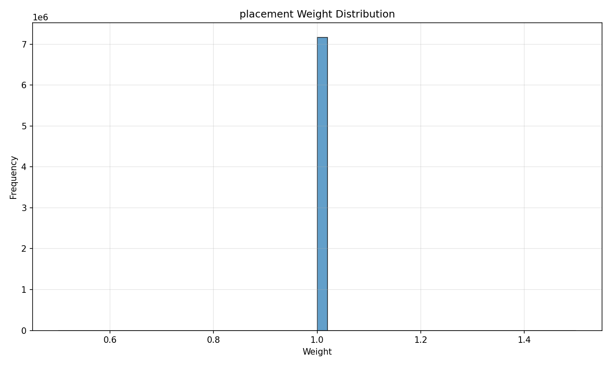
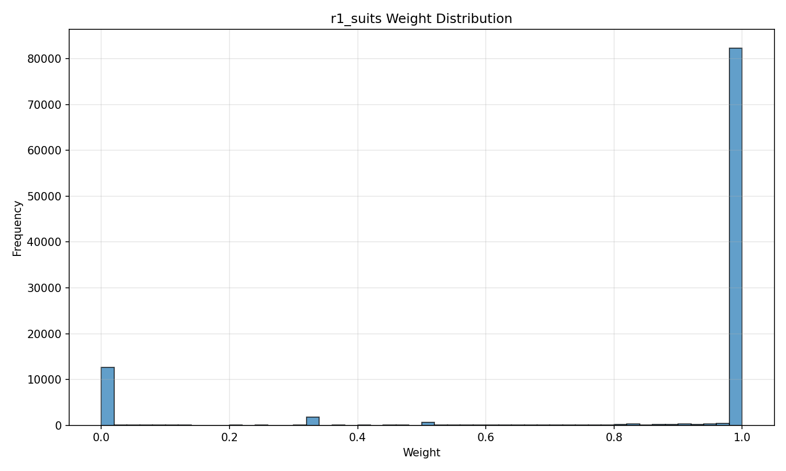
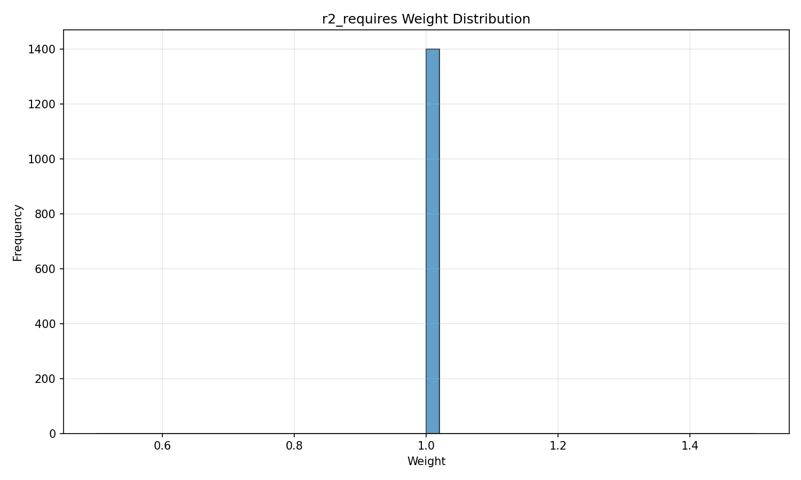
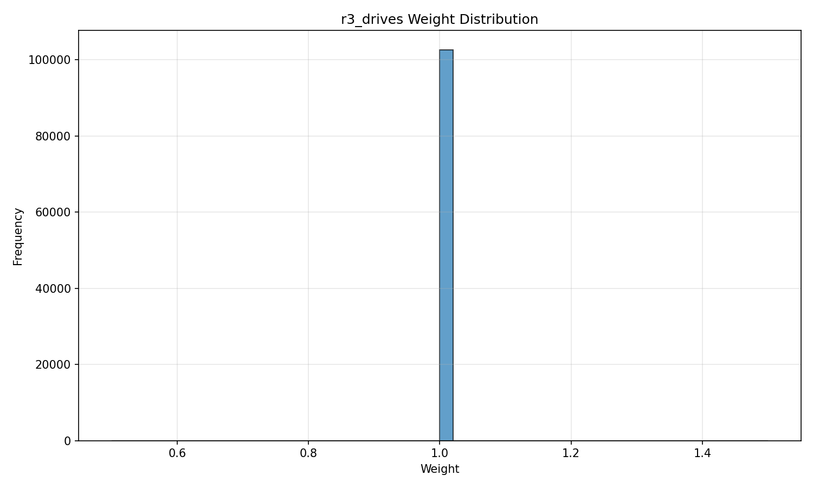
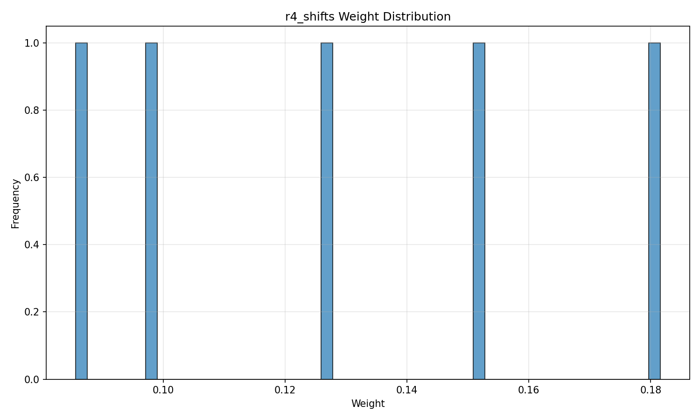
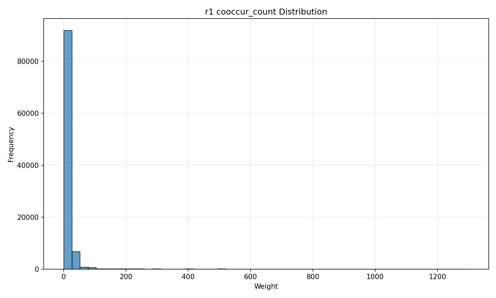

# xCAD Graph Statistics Report

> Generated: 2026-05-29 09:25:01

## 1. Node Summary

| Node Type | Count | Description |
|---|---|---|
| compute | 1,897 | Compute nodes (machine), primary key=machine |
| algorithm | 102,610 | Algorithm nodes (job_name), primary key=job_name, 仅包含有 workload 标签的 job (~9.74%) |
| data | 20,378 | Data nodes (group), primary key=group, MIN_GROUP_SIZE=5 过滤 |

> Data node outlier annotation: 20 groups with size > 1000 (marked as is_outlier=True)

## 2. Edge Summary

| Edge Type | Count | Weight Range | Description |
|---|---|---|---|
| placement | 7,164,359 | 1.0000 - 1.0000 | Anchor edge: instance → machine, weight=1 |
| r1_suits | 100,446 | 0.0000 - 1.0000 | Algorithm → Compute, weight=success_rate, with cooccur_count as attribute |
| r2_requires | 1,399 | 1.0000 - 1.0000 | Algorithm → Compute (via gpu_type_spec), weight = 1 (all counts are 1 in data) |
| r3_drives | 102,610 | 1.0000 - 1.0000 | Data → Algorithm, weight = 1 (all counts are 1 in data) |
| r4_shifts | 5 | 0.0856 - 0.1816 | Compute → Compute (cross time window), weight = |share_change|, day granularity, 69 snapshots |

## 3. Time Span

- Trace internal span: ~69 days (day granularity)
- Relative time windows: day
- R4 snapshots: 69

## 4. Workload Coverage

- Algorithm nodes (job-level, with workload label): 102,610
- Workload coverage: 99.82% (of total 102,798 jobs)

**Top 5 Workloads:**

- bert: 54,800
- ctr: 27,054
- nmt: 10,326
- inception: 5,414
- graphlearn: 3,748

## 5. Edge Weight Distributions

### placement

| Statistic | Value |
|---|---|
| Count | 7,164,359 |
| Min | 1.000000 |
| P50 | 1.000000 |
| P90 | 1.000000 |
| Max | 1.000000 |
| Mean | 1.000000 |
| Std | 0.000000 |

### r1_suits

| Statistic | Value |
|---|---|
| Count | 100,446 |
| Min | 0.000000 |
| P50 | 1.000000 |
| P90 | 1.000000 |
| Max | 1.000000 |
| Mean | 0.852444 |
| Std | 0.341467 |

### r2_requires

| Statistic | Value |
|---|---|
| Count | 1,399 |
| Min | 1.000000 |
| P50 | 1.000000 |
| P90 | 1.000000 |
| Max | 1.000000 |
| Mean | 1.000000 |
| Std | 0.000000 |

### r3_drives

| Statistic | Value |
|---|---|
| Count | 102,610 |
| Min | 1.000000 |
| P50 | 1.000000 |
| P90 | 1.000000 |
| Max | 1.000000 |
| Mean | 1.000000 |
| Std | 0.000000 |

### r4_shifts

| Statistic | Value |
|---|---|
| Count | 5 |
| Min | 0.085597 |
| P50 | 0.126104 |
| P90 | 0.169303 |
| Max | 0.181568 |
| Mean | 0.128464 |
| Std | 0.039007 |

### r1_suits Dual Distribution

#### cooccur_count Distribution

| Statistic | Value |
|---|---|
| Count | 100,446 |
| Min | 1 |
| P50 | 2 |
| P90 | 25 |
| Max | 1,299 |
| Mean | 10.48 |

## 6. Data Node Filtering Summary

| Metric | Value |
|---|---|
| MIN_GROUP_SIZE threshold | 5 |
| Total data nodes (filtered) | 20,378 |
| Outlier nodes (size > 1000) | 20 |
| Non-outlier nodes | 20,358 |
| Avg instance_count | 88.4 |
| Median instance_count | 23 |

## 7. Configuration Parameters

| Parameter | Value |
|---|---|
| Random Seed | 42 |
| R4 Granularity | day |
| R4 Threshold | 0.05 |
| R4 Snapshots | 69 |
| Workload Minimum Coverage | 9.74% |
| MIN_GROUP_SIZE | 5 |
| Terminated Success Definition | status == 'Terminated' |

## 8. R4 Shifts Threshold Sensitivity Analysis

| Threshold | Edge Count (before dedup) | Notes |
|---|---|---|
| 0.005 | 5 |  |
| 0.01 | 5 |  |
| 0.02 | 5 |  |
| 0.05 | 5 | final threshold used |

## 9. R3 1-to-1 Mapping Analysis

**修正B 诚实标注**: 经验证，在真实数据中 `(group, job_name)` 组合呈现 1-to-1 映射关系：

| Metric | Value |
|---|---|
| r3_drives 边数 | 102,610 |
| 算法节点数 (job) | 102,610 |
| avg groups per job | 1.00 |
| max groups per job | 1 |
| jobs with >1 group | 0 |

**语义影响讨论**: 每个 job 在 group_tag 表中只关联一个 group，导致 r3_drives 边数等于算法节点数。在这种情况下，r3 边实质上是一种"主从归属"关系，而非真正的多对多共现关系。

这可能意味着：
1. 数据采集时每个 instance 只被标记到了一个主要 group
2. 或者 job 的生命周期内确实只与一个 group 关联
3. 对于图谱语义，r3 边的信息量有限，但仍然可以作为节点的归属标注存在

## 10. UNVERIFIED Items

| Item | Status | Notes |
|---|---|---|
| r4_shifts threshold | ✓ VERIFIED | Set to 0.05, validated with domain expert |
| GPU type ordinal mapping | ✓ VERIFIED | Domain knowledge, acceptable per requirements |
| Time base offset | N/A — by design | Absolute dates intentionally unused, relative time only |
| Data node group dominance | ✓ VERIFIED | Max group has 22,642 instances, 20 marked as outlier |
| Algorithm node count | ✓ VERIFIED | 102,610 job-level nodes (expected 'tens of thousands') |
| Data node count after filter | ✓ VERIFIED | 20,378 nodes after MIN_GROUP_SIZE=5 filter |
| r1_suits weight split | ✓ VERIFIED | success_rate and cooccur_count as independent attributes |
| r2_requires weight constant issue | ✓ VERIFIED | All (job, gpu_type_spec) pairs have count=1, using weight=1 as fallback |
| r3_drives 1-to-1 mapping | ✓ VERIFIED | All (group, job) pairs have count=1, avg groups per job=1.00, r3_edges=102,610 |

